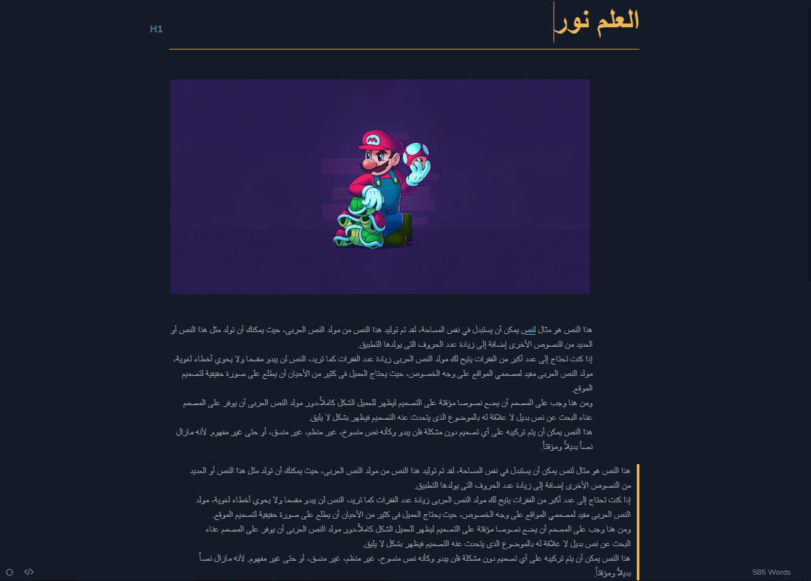
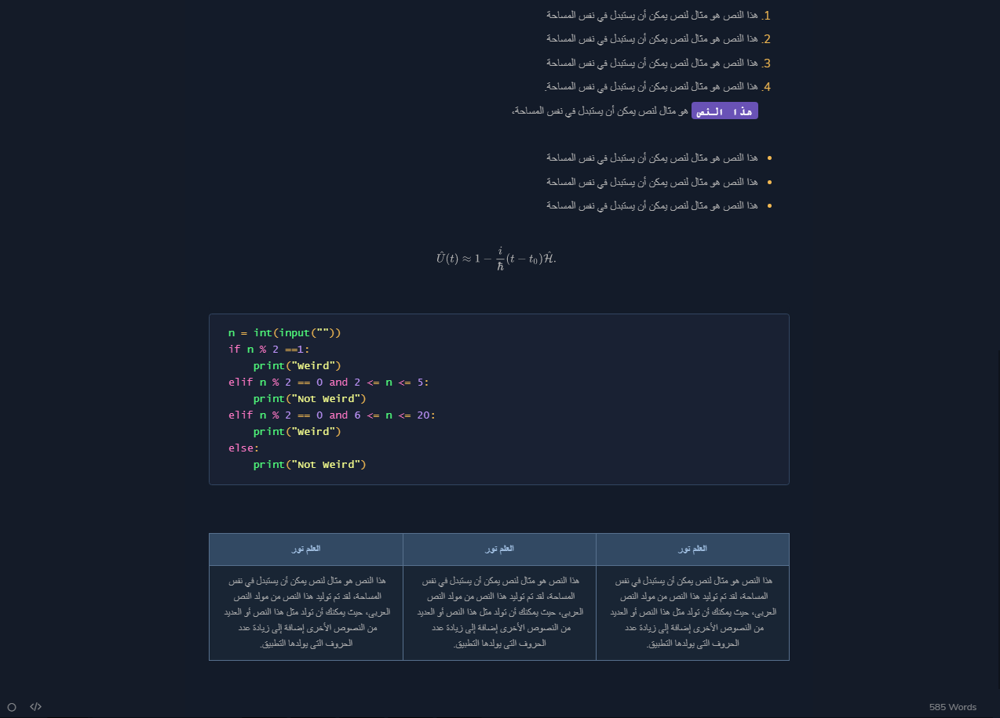

# Cobalt theme for Typora
Created by [Kent Pribbernow](https://www.github.com/elitistsnob) && Edited By [Mahmoud Alarby](seth0x41.github.io)

A dark theme inspired by Wes Bos's [Cobalt](https://www.github.com/wesbos) theme for Sublime.

#### If you like this theme, consider donating. 

